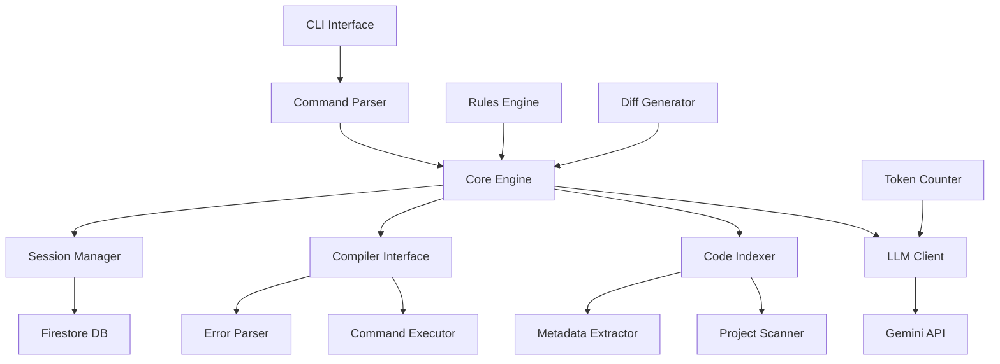
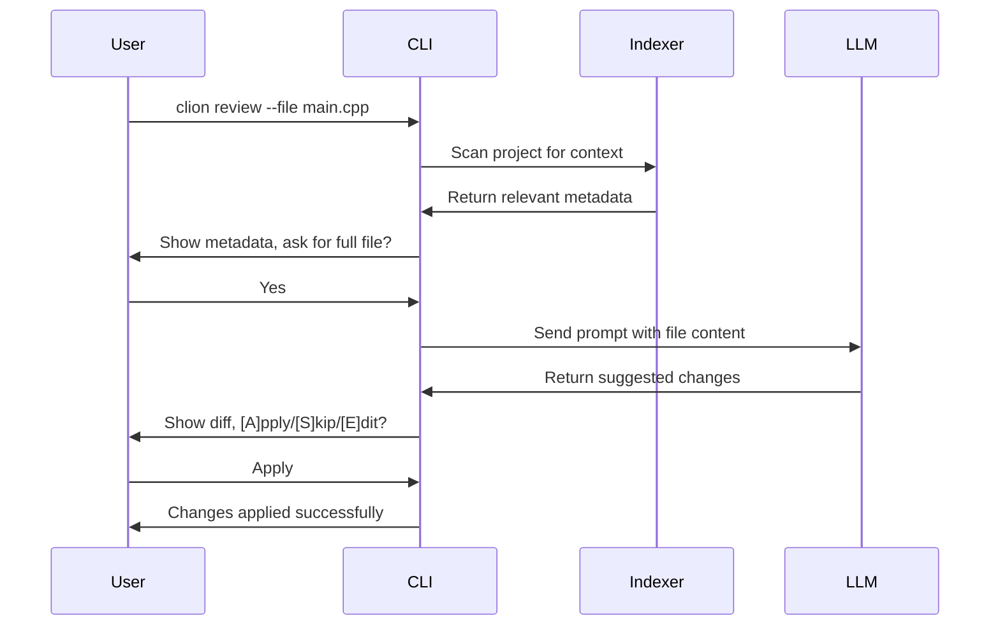
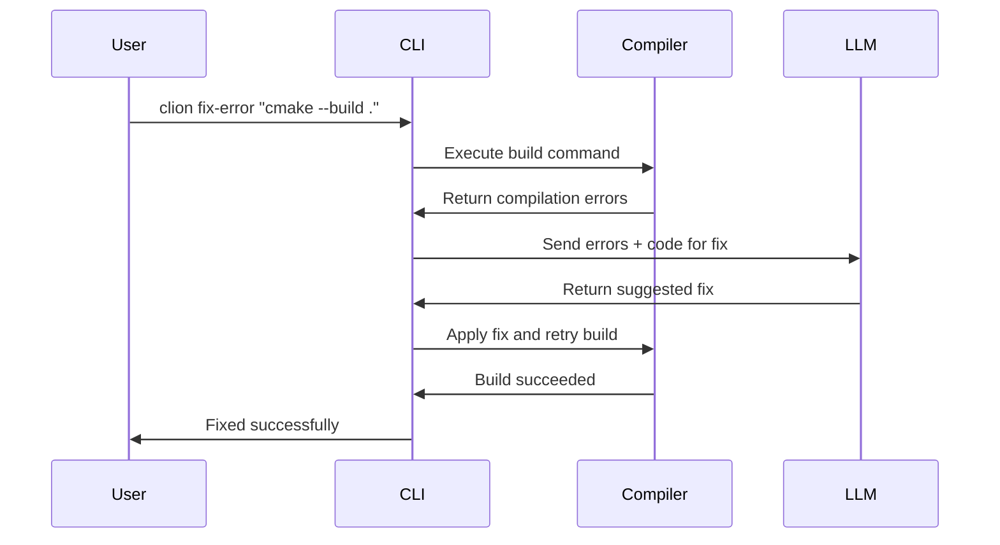

# CLion (Command Line Lion) - C++ Agentic CLI Tool Architecture

## Overview

CLion is a high-performance, native C++ CLI tool that acts as an autonomous pair programmer for C++ projects. It leverages AI models (specifically Google's Gemini API) to provide intelligent code assistance, with unique features like native C++ code indexing and compiler feedback loops.

## System Architecture



## Project Structure

```
clion/
├── CMakeLists.txt
├── README.md
├── .gitignore
├── .clionrules.yaml
├── src/
│   ├── main.cpp
│   ├── cli/
│   │   ├── cli_parser.cpp
│   │   ├── cli_parser.h
│   │   ├── interaction.cpp
│   │   └── interaction.h
│   ├── llm/
│   │   ├── llm_client.cpp
│   │   ├── llm_client.h
│   │   ├── context_builder.cpp
│   │   ├── context_builder.h
│   │   ├── session.cpp
│   │   └── session.h
│   ├── indexer/
│   │   ├── project_scanner.cpp
│   │   ├── project_scanner.h
│   │   ├── code_index.cpp
│   │   ├── code_index.h
│   │   ├── prompt_analyzer.cpp
│   │   └── prompt_analyzer.h
│   ├── compiler/
│   │   ├── command_executor.cpp
│   │   ├── command_executor.h
│   │   ├── error_parser.cpp
│   │   └── error_parser.h
│   └── utils/
│       ├── file_utils.cpp
│       ├── file_utils.h
│       ├── diff_utils.cpp
│       ├── diff_utils.h
│       ├── token_counter.cpp
│       ├── token_counter.h
│       ├── rules_loader.cpp
│       └── rules_loader.h
├── include/
│   └── clion/
│       └── common.h
├── tests/
│   ├── unit/
│   └── integration/
├── external/
│   └── README.md
└── docs/
    ├── API.md
    ├── USER_GUIDE.md
    └── DEVELOPMENT.md
```

## Core Components

### 1. CLI Interface (`src/cli/`)

**Responsibilities:**
- Parse command-line arguments using CLI11
- Handle user interactions and approvals
- Display output and progress information

**Key Classes:**
- `CLIParser`: Main argument parsing logic
- `InteractionHandler`: User prompts and approvals

**Commands:**
- `clion review --file <path>`: Review and suggest improvements
- `clion fix-error <command>`: Automatically fix compilation errors
- `clion --explain`: Show detailed reasoning and costs

### 2. LLM Client (`src/llm/`)

**Responsibilities:**
- Communicate with Gemini API
- Build context-aware prompts
- Manage conversation history

**Key Classes:**
- `LLMClient`: HTTP client for API requests
- `ContextBuilder`: Constructs prompts with file contents
- `SessionManager`: Handles conversation persistence

**API Integration:**
```cpp
class LLMClient {
public:
    struct Response {
        std::string content;
        std::vector<std::string> sources;
        int tokens_used;
    };
    
    Response sendRequest(const std::string& prompt, const std::string& system_instruction = "");
};
```

### 3. Code Indexer (`src/indexer/`)

**Responsibilities:**
- Scan project directories
- Extract C++ metadata (functions, classes, etc.)
- Optimize context selection

**Key Classes:**
- `ProjectScanner`: Recursive file discovery
- `CodeIndex`: In-memory metadata storage
- `PromptAnalyzer`: Intelligent context selection

**Index Structure:**
```cpp
struct CodeMetadata {
    std::string file_path;
    std::vector<std::string> functions;
    std::vector<std::string> classes;
    std::vector<std::string> includes;
};

using CodeIndex = std::unordered_map<std::string, CodeMetadata>;
```

### 4. Compiler Interface (`src/compiler/`)

**Responsibilities:**
- Execute build commands
- Parse compiler errors
- Implement iterative fix workflow

**Key Classes:**
- `CommandExecutor`: Shell command execution
- `ErrorParser`: Extract structured error information

**Error Structure:**
```cpp
struct CompilerError {
    std::string file_path;
    int line_number;
    int column;
    std::string severity;
    std::string message;
};
```

### 5. Utilities (`src/utils/`)

**Responsibilities:**
- File I/O operations
- Diff generation and application
- Token counting
- Rules configuration

**Key Classes:**
- `FileUtils`: File reading and writing
- `DiffUtils`: Unified diff operations
- `TokenCounter`: LLM token estimation
- `RulesLoader`: Project-specific configuration

## Key Dependencies

- **CLI11**: Command-line argument parsing
- **CURL**: HTTP client for API requests
- **nlohmann/json**: JSON parsing and generation
- **Firestore C++ SDK**: Session persistence
- **YAML-CPP**: Configuration file parsing
- **Boost.Regex** (or std::regex): Pattern matching for code parsing

## Workflow Examples

### Code Review Workflow



### Error Fix Workflow



## Configuration

### .clionrules.yaml Structure

```yaml
# Project-specific coding conventions
rules:
  - name: "naming_convention"
    instruction: "Use snake_case for function names and PascalCase for class names"
    priority: "high"
  - name: "modern_cpp"
    instruction: "Prefer smart pointers over raw pointers"
    priority: "medium"

# API configuration
api:
  provider: "gemini"
  model: "gemini-pro"
  max_tokens: 8192
  temperature: 0.1

# Indexer configuration
indexer:
  include_patterns: ["*.cpp", "*.h", "*.hpp", "*.cc", "*.cxx"]
  exclude_patterns: ["build/*", "vendor/*", "*.pb.cc"]
  respect_gitignore: true
```

## Performance Considerations

1. **Native C++ Performance**: Leverage C++20 features for efficient memory management and parallel processing
2. **Intelligent Caching**: Cache code indices and session data locally
3. **Incremental Scanning**: Only rescan changed files for project indexing
4. **Token Optimization**: Use metadata instead of full file content when possible

## Security Considerations

1. **API Key Management**: Secure storage of API keys
2. **Code Privacy**: Ensure no code is sent to external services without user consent
3. **Sandboxing**: Execute build commands in controlled environments
4. **Input Validation**: Validate all user inputs and file paths

## Future Enhancements

1. **Multi-LLM Support**: Support for different AI providers
2. **Language Extensions**: Support for additional programming languages
3. **Plugin System**: Extensible architecture for custom features
4. **Team Collaboration**: Shared sessions and code reviews
5. **IDE Integration**: VS Code, CLion, and other editor plugins