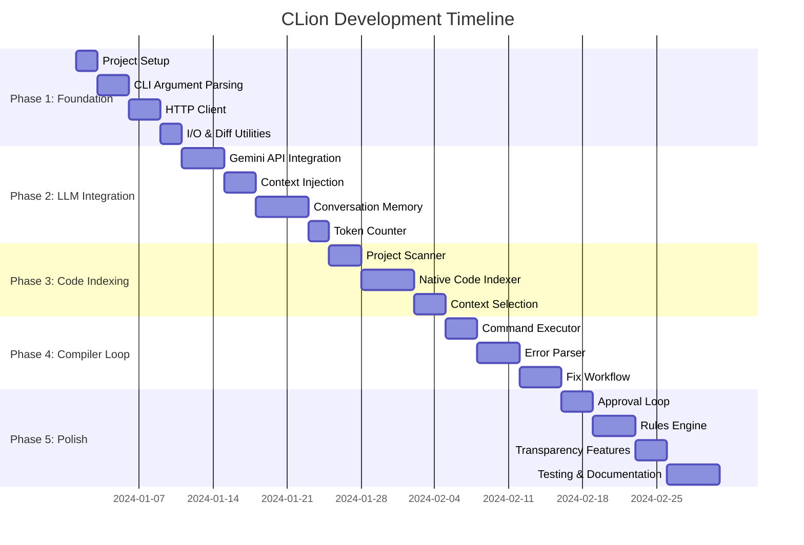
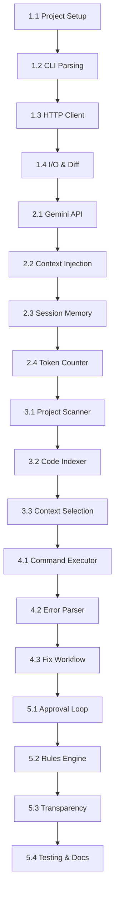

# CLion Development Roadmap

This roadmap provides a timeline and dependency graph for implementing the CLion C++ Agentic CLI Tool.

## Project Timeline Overview

## Phase-by-Phase Breakdown

### Phase 1: Foundation and Core CLI Structure (10 days)

**Goal**: Establish a robust C++ executable with clear command-line parsing and basic user interaction.

| Task | Duration | Dependencies | Risk Level |
|------|----------|--------------|------------|
| 1.1 Project Setup | 2 days | None | Low |
| 1.2 Argument Parsing | 3 days | 1.1 | Low |
| 1.3 HTTP Client | 3 days | 1.2 | Medium |
| 1.4 I/O & Diff Utilities | 2 days | 1.3 | Low |

**Key Deliverables**:
- Working CMake build system
- Basic CLI with `review` command
- HTTP client capable of making requests
- File reading and diff generation utilities

**Potential Challenges**:
- Setting up all dependencies (CURL, CLI11, etc.) across platforms
- Implementing robust error handling for network operations

### Phase 2: LLM Communication and Context Handling (14 days)

**Goal**: Enable the tool to communicate with the LLM and effectively gather project context.

| Task | Duration | Dependencies | Risk Level |
|------|----------|--------------|------------|
| 2.1 Gemini API Integration | 4 days | 1.4 | High |
| 2.2 Context Injection | 3 days | 2.1 | Medium |
| 2.3 Conversation Memory | 5 days | 2.2 | High |
| 2.4 Token Counter | 2 days | 2.3 | Low |

**Key Deliverables**:
- Full Gemini API integration with JSON handling
- Context builder with file inclusion support
- Session persistence with Firestore
- Real-time token usage display

**Potential Challenges**:
- Firestore C++ SDK integration complexity
- Handling API rate limits and authentication
- Efficient context management for large projects

### Phase 3: Native C++ Indexing (11 days)

**Goal**: Implement the high-performance context feature that sets CLion apart.

| Task | Duration | Dependencies | Risk Level |
|------|----------|--------------|------------|
| 3.1 Project Scanner | 3 days | 2.4 | Medium |
| 3.2 Native Code Indexer | 5 days | 3.1 | High |
| 3.3 Context Selection | 3 days | 3.2 | Medium |

**Key Deliverables**:
- Fast project scanner with .gitignore support
- C++ metadata extraction and indexing
- Intelligent context selection with user confirmation

**Potential Challenges**:
- Complex regex patterns for C++ parsing
- Performance optimization for large codebases
- Handling various C++ dialects and edge cases

### Phase 4: Compiler Feedback Loop (11 days)

**Goal**: Enable the agent to automatically fix code based on actual compiler errors.

| Task | Duration | Dependencies | Risk Level |
|------|----------|--------------|------------|
| 4.1 Command Executor | 3 days | 3.3 | Medium |
| 4.2 Error Parser | 4 days | 4.1 | High |
| 4.3 Fix Workflow | 4 days | 4.2 | High |

**Key Deliverables**:
- Command execution with output capture
- Multi-compiler error parsing
- Iterative fix workflow with retry logic

**Potential Challenges**:
- Platform-specific command execution
- Parsing various compiler error formats
- Handling circular fix dependencies

### Phase 5: User Experience and Final Polish (15 days)

**Goal**: Ensure a smooth, secure, and transparent user experience.

| Task | Duration | Dependencies | Risk Level |
|------|----------|--------------|------------|
| 5.1 Approval Loop | 3 days | 4.3 | Low |
| 5.2 Rules Engine | 4 days | 5.1 | Medium |
| 5.3 Transparency Features | 3 days | 5.2 | Low |
| 5.4 Testing & Documentation | 5 days | 5.3 | Low |

**Key Deliverables**:
- Interactive approval system for changes
- Configurable rules engine with YAML support
- Explain mode with detailed reasoning
- Comprehensive test suite and documentation

**Potential Challenges**:
- Designing intuitive user interactions
- Balancing feature completeness with simplicity
- Ensuring security for automated code changes

## Dependency Graph

## Resource Requirements

### Development Environment
- **Compiler**: GCC 10+ or Clang 10+ with C++20 support
- **Build System**: CMake 3.16+
- **Version Control**: Git
- **IDE**: CLion, VS Code, or similar

### External Dependencies
- **CLI11**: Command-line parsing
- **CURL**: HTTP client
- **nlohmann/json**: JSON parsing
- **Firestore C++ SDK**: Session persistence
- **YAML-CPP**: Configuration parsing
- **Boost.Regex**: Advanced pattern matching (optional)

### Testing Framework
- **Google Test**: Unit testing
- **Google Mock**: Mocking for testing
- **Valgrind**: Memory leak detection
- **AddressSanitizer**: Runtime error detection

## Milestones and Validation

### Milestone 1: Basic CLI (After Phase 1)
**Validation Criteria**:
- Can build and run `clion review --file <path>`
- HTTP client can make successful requests
- Diff generation works correctly

### Milestone 2: LLM Integration (After Phase 2)
**Validation Criteria**:
- Can send requests to Gemini API and receive responses
- File inclusion (@file syntax) works
- Session persistence across runs

### Milestone 3: Smart Indexing (After Phase 3)
**Validation Criteria**:
- Can index a medium-sized C++ project (<1000 files) in <5 seconds
- Context selection reduces token usage by >50%
- User confirmation flow works correctly

### Milestone 4: Auto-Fix (After Phase 4)
**Validation Criteria**:
- Can fix common compilation errors automatically
- Supports at least GCC and Clang
- Iterative workflow converges in <3 attempts

### Milestone 5: Production Ready (After Phase 5)
**Validation Criteria**:
- All features work end-to-end
- Comprehensive test coverage (>80%)
- Documentation is complete
- Security review passed

## Risk Mitigation Strategies

### Technical Risks
1. **Dependency Management**: Use vcpkg or Conan for consistent dependency management
2. **Platform Compatibility**: Set up CI/CD with multiple OS targets
3. **Performance**: Profile early and optimize bottlenecks
4. **API Limitations**: Implement local caching and fallback strategies

### Project Risks
1. **Scope Creep**: Strictly adhere to defined MVP features
2. **Timeline Delays**: Build buffer time into estimates
3. **Quality Issues**: Implement code reviews and testing standards
4. **Security Concerns**: Regular security audits and input validation

## Success Metrics

### Performance Metrics
- **Startup Time**: <500ms for small projects
- **Indexing Speed**: <100ms per 100 files
- **API Response Time**: <5 seconds for typical requests
- **Memory Usage**: <100MB for medium projects

### User Experience Metrics
- **Task Completion Rate**: >95% for common use cases
- **Error Fix Success Rate**: >80% for common compilation errors
- **User Satisfaction**: Target >4/5 in user feedback
- **Adoption Rate**: Measure through downloads and usage analytics

## Next Steps

1. **Environment Setup**: Prepare development environment with all dependencies
2. **Repository Creation**: Set up Git repository with proper structure
3. **CI/CD Pipeline**: Configure automated testing and builds
4. **Begin Phase 1**: Start with project setup and basic CLI structure
5. **Regular Reviews**: Schedule weekly progress reviews and adjustments

This roadmap provides a clear path forward for developing CLion, with realistic timelines and contingency plans for potential challenges.